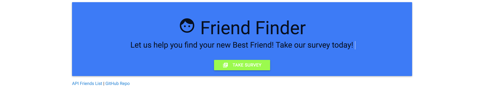

# Friend Finder

This build is a compatibility-based "FriendFinder" application -- basically a dating app. This full-stack site will take in results from your users' surveys, then compare their answers with those from other users. The app will then display the name and picture of the user with the best overall match. 

It uses Express to handle routing and deploy's the app to Heroku so other users can fill it out.

## Check out Live page on Heroku
https://rocky-oasis-31618.herokuapp.com/

## Getting Started
The main pages displays a nice welcome message with a link to the survey page to get started. Also included on the bottom left footer are links to the API holding friend information and a link to this github page.

Moving on to the survery page you are presented with a form and questionaire to fill out that requires your name and photo image. You can then reply to the questionaire with choices from strongly agree to strongly disagree.

![Screen shot] (images/Survery_Page.png)

![Screen shot] (images/Demo_Page.png)
